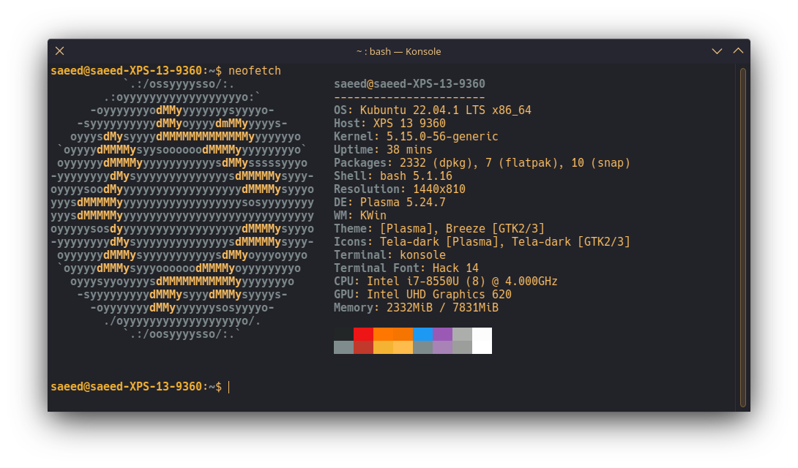
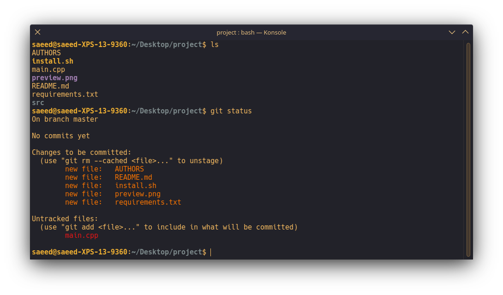

# Sandy
A Konsole colorscheme, based on the [Stone konsole theme](https://store.kde.org/p/1918391/).

  

  
    Aurorae Decoarations: Default
  

Example of what the colorscheme looks like in action:

  

## Installation
1. Download the [latest release](https://github.com/SaeedBaig/sandy-konsole/releases/).
2. Move the `Sandy.colorscheme` file to `~/.local/share/konsole/`
